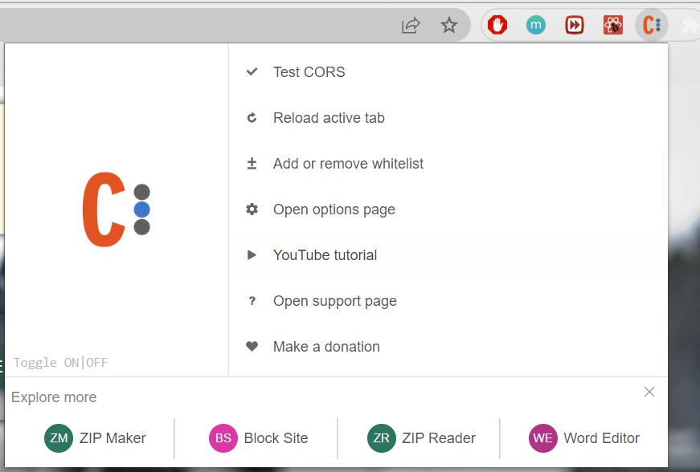
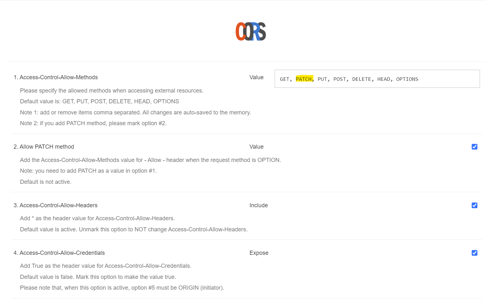

# Worldwide Equipment Guide (WEG) Mission Planner 

>Add any files you see fit for your application to work. Make sure to change this README to include a meaningful description of your application and how to get it started.

# Overview
  >The WEG Mission Planner is a tool that enables a user to create missions that will keep track of various equipment inside the WEG (2015 version), and tracks for the mission where the equipment isand other various information, and export that information to a `.csv` for use in the Hawg View | CAS Planner application https://www.hawg-ops.com/
# Table of Contents
  >- Description
  >- Application Walkthrough
  >- Installation & Setup
  >- Usage
  >- License & Accreditation

# Description
## Problem Statement
>I don't have an accessible way to find & track foreign equipment information in order to develop courses of action & wargame military operations.

## User Stories
>- As a mission planner, I want to keep track of where equipment is during a phase of a mission
>- As a mission planner, I want to see a list of equipment in a mission
>- As a mission planner, once equipment is added to a mission I want to add multiple quantities of the same equipment to that mission
>- As a mission planner, I want to add equipment to a mission to keep track of for later
>- As a mission planner, I want to see  info about a piece of equipment to assist in mission planning
>- As a mission planner, I want to create a mission that will track a list of foreign equipment from opposing forces

# Application Walkthrough
## Home Page: 
> Home Page presents the title of the application in the top center, "Worldwide Equipment Guide" and four clickable options: 1. "Create New Equipment," 2. "Create New Mission," 3. "Search Missions," and 4. "Toggle Background". These options allow the user to create new equipment, missions, or search for existing missions right from the homepage. 
### Create New Equipment:
>- Select the "Create New Equipment" box 
>- Fill drop down menu values
>- Click submit button
>- Equipment is now added to database

### Create New Misssion:
>- Fill drown down menu values
>- App navigates user to add equipment to mission page
>- See "Add Equipment to Mission" page

### Search Missions:
>- Select "Search Missions" box
>- Fill search form
>- Matching search results will adjust to match search query
>- Selecting search result to redirect to that mission's page

### Mission Page:
>- Mission Information Widget: 
>- Add Equipment: The green plus (+) symbol navigates user to the "Add Equipment to Mission" page
>- Delete Mission: The red 'X' symbol deletes the current mission from the database. 
>- Title: Displays title of the currently selected mission
>- Export link: Exports equipment and its location metadata into a csv file for Hawg View (https://hawg-ops.com/)
>- Location: Displays location center for the mission (latitude / longitude)
>- Equipment Image: Clicking the equipment image navigates user the the detail page for the selected equipment.
>- Edit Button: Below equipment summary, the "EDIT" button opens a dialog box to edit the metadata. Missions can repeat equipment entries to accomodate multiple pieces of equipment in different locations by phase of the operation.
>-Delete Equipment: The red 'X' symbol below each equipment deletes the equipment entry from the mission.

### Add Equipment to Mission:
>- Equipment Filters 
>- Filter by category
>- Filter by subcategory
>- Add equipment (+) to the current mission
>- Alert message: "Equipment ID: # added to Mission ID: #
>- Page Navigation: 
>- "Return Home" button in upper right corner returns to the home page
>- "Go back to mission" in upper left" returns to mission page displaying all equipment

### Equipment Details
#### Option 1:
>- From the home page, click search mission button
>- Search and select any particular mission
>- Click image of any equipment
#### Option 2:
>- From the home page, click search mission button
>- Search and select any particular mission
>- Click the '+' icon to add equipment
>- Click image of any equipment
#### Option 3:
>- From the home page, click create mission button
>- App navigates user to add equipment to mission page
>- See "Add Equipment to Mission" page
>- Click image of any equipment

### Background Slide Toggle: 
>- Toggles between two background iamges 
>- One designed for protrait view
>- One designed for landscape view

# Installation & Setup
  - Clone Repository
    - `git clone https://github.com/rtg8008/sdi-blended-full-stack-project-scaffold.git "your directory"`
  - Setup data-base
    - setup postgresql database with following parameters per our `knexfile.js`
     ```js
      development: {
      client: 'postgresql',
      connection: {
        host: '127.0.0.1',
        password: 'docker',
        user: 'postgres', //default postgres user
        port: 5432,
        database: 'weg_database' // expected database name to be created
      }
    }
     ```
     
    - create database weg-database
      >- `CREATE DATABASE weg-database`
  - Setup back-end
    >- navigate to `back-end` directory
      >- `cd back-end/`
    >- install dependencies
      >- `npm install`
    >- start back-end application
      >- `npx knex migrate:rollback --all`
      >- `npx knex migrate:latest`
      >- `npx knex seed:run`
      >- `npm start`
  - Setup front-end
    >- navigate to `front-end` directory
      >- `cd front-end`
    >- install dependencies
      >- `npm install`
    >- run front-end application
      >- `npm start`
  - Add and Setup Allow CORS chrome extension
    